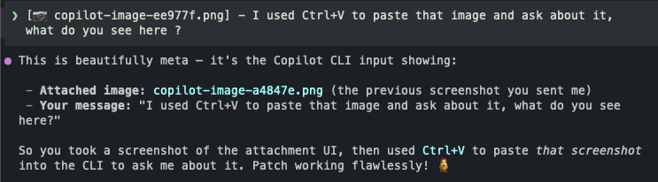

# copilot-cli-image-paste

> **macOS clipboard image paste support for [GitHub Copilot CLI](https://github.com/github/copilot-cli)**

Take a screenshot → press **`Ctrl+V`** in the Copilot CLI terminal → the image is attached to your message. Done.



This feature works on Windows out of the box. On macOS it doesn't — this patch fixes that.

---

## Quick Start

```bash
# 1. Download and run the patch script
curl -fsSL https://raw.githubusercontent.com/idanshimon/copilot-cli-image-paste/main/patch.sh | bash

# 2. Add a shell alias so you can re-patch after CLI updates
echo "alias copilot-patch='bash <(curl -fsSL https://raw.githubusercontent.com/idanshimon/copilot-cli-image-paste/main/patch.sh)'" >> ~/.zshrc
source ~/.zshrc
```

**After a Copilot CLI update**, just run:
```bash
copilot-patch
```

---

## Usage

1. Take a screenshot:
   - **`Cmd + Shift + 4`** — region screenshot (copies to clipboard)
   - **`Cmd + Shift + 3`** — full screen (copies to clipboard)
   - **`Win + Shift + S`** equivalent on macOS
2. Switch to the Copilot CLI terminal
3. Press **`Ctrl+V`**
4. The image appears as an attachment — type your question and send

---

## Why Does This Happen?

### The Windows behavior (working)

On Windows, when you press `Ctrl+V` with an image on the clipboard, **Windows Terminal** emits an _empty_ [bracketed paste](https://en.wikipedia.org/wiki/Bracketed-paste) sequence into the process:

```
\x1B[200~\x1B[201~
```

The Copilot CLI detects this empty paste and thinks: _"the user tried to paste, but there was no text — maybe there's an image."_ It then calls `ClipboardManager().getImageData()`, reads the image, and attaches it.

### The macOS problem

On macOS, `Cmd+V` is intercepted by the **terminal emulator** (Terminal.app or iTerm2) at the OS level — it never reaches the running process directly. The terminal decides what to send:

| Clipboard contains | What the terminal sends to the process |
|---|---|
| Text | Bracketed paste with the text content |
| **Image only** | **Nothing at all** ← the problem |

`Ctrl+V` (without `Cmd`) does reach the process — but as the raw byte `\x16` (ASCII 22), which the CLI treats as a literal character to insert. It never triggers the image paste path.

**Result:** There is no keyboard shortcut on macOS that causes the CLI to check the clipboard for an image.

---

## How the Patch Works

### Injection point

The Copilot CLI's bundled `app.js` (14 MB, minified) loads the native clipboard library like this:

```javascript
// Inside app.js (simplified)
const __clipboardRequire = createRequire('<pkg>/clipboard/index.js')
const { ClipboardManager } = __clipboardRequire('@teddyzhu/clipboard')
```

This resolves to:
```
~/.copilot/pkg/universal/<version>/clipboard/node_modules/@teddyzhu/clipboard/index.js
```

The patch appends code to the **end of that file**. When the module is evaluated, our code runs in the same Node.js process as the CLI — before the readline loop starts — giving us access to `process.stdin`.

### What the patch does

```
On module load:
  IF platform is macOS AND stdin is a TTY:
    wrap process.stdin.read()

On each stdin.read() call (no-arg reads only):
  chunk = original_read()

  IF chunk contains Ctrl+V (byte 0x16):
    hasText = clipboard.getText()    ← throws if empty → false

    IF no text on clipboard:
      imgData = clipboard.getImageData()   ← throws if no image

      IF image found:
        REPLACE 0x16 in chunk with "\x1B[200~\x1B[201~"
        RETURN modified chunk
        → CLI sees an empty bracketed paste
        → triggers onEmptyPasteFallback()
        → calls ClipboardManager().getImageData()
        → image attached ✓

  RETURN chunk unchanged   ← text clipboard, no clipboard content, or any error
```

### Backspace whole-token deletion fix

After the paste sequence is injected the CLI runs an async chain to fetch the image, write a temp file, and call `insertInput()` to place the `[📷 filename.png]` token in the input buffer. This chain takes roughly 20–100 ms.

If the user presses **Backspace** before the chain completes the token doesn't exist yet, so the CLI's `oNt()` (whole-token backspace handler) finds nothing and falls back to deleting one character at a time.

The patch tracks a `_pasteTs` timestamp whenever it injects a paste sequence. If a **solo `\x7f`** (Backspace) arrives within **500 ms**, the patch:

1. Intercepts it and returns `null` to the readline loop (nothing happens visually).
2. Schedules `process.stdin.push('\x7f')` via `setTimeout` after the remaining window expires.
3. When the timer fires the token is already in the input; `oNt()` deletes the whole token at once — matching Windows behavior.

### Why `stdin.read()` and not something else

The CLI's input loop works like this:

```
process.stdin.on("readable", () => {
  const chunk = process.stdin.read()   ← our intercept point
  internal_eventEmitter.emit("input", chunk)
})
```

The internal event emitter is buried inside a React context provider — not accessible from outside. `process.stdin.read()` is the earliest accessible point in the data pipeline.

### Safety properties

- **Only activates on macOS TTY sessions** — no effect on Windows, Linux, or non-interactive pipes
- **Only intercepts zero-arg reads** — `read(n)` sized reads are untouched
- **Text clipboard passes through** — if there's text on the clipboard, `\x16` is returned unchanged; the CLI handles it normally
- **All errors are caught** — `getImageData()` throws when no image is present; every code path falls through to the original chunk
- **Module load is protected** — the entire patch is wrapped in `try/catch`; if anything goes wrong, the clipboard module loads normally

---

## File Structure

```
~/.copilot/pkg/universal/
└── <version>/
    └── clipboard/
        └── node_modules/
            └── @teddyzhu/clipboard/
                └── index.js   ← patch appended here
```

The patch script iterates all version directories and skips any already patched (idempotent).

---

## After a CLI Update

GitHub Copilot CLI installs each version into its own versioned directory. Your existing patched versions remain intact. New versions are not patched automatically.

Run `copilot-patch` after each update:

```bash
copilot-patch
# ⏭  Already patched: 1.0.40-0
# ✅ Patched:         1.0.41-0
```

---

## Check Patch Status

```bash
bash patch.sh --check
# ⏭  Already patched: 1.0.40-0
# 🔲 Not patched:     1.0.41-0
```

---

## Compatibility

| Platform | Status |
|---|---|
| macOS (Apple Silicon) | ✅ Supported |
| macOS (Intel) | ✅ Supported |
| Windows | ✅ Works natively — no patch needed |
| Linux | ✅ Works natively — no patch needed |

Tested with:
- Terminal.app
- iTerm2
- Copilot CLI versions `1.0.37` through `1.0.40-2`

---

## Known Limitations

_None currently._ The patch handles both image paste and whole-token backspace deletion.


The [`github/copilot-cli`](https://github.com/github/copilot-cli) repository is a **distribution-only repo** — it contains no source code (just `README.md`, `install.sh`, and `LICENSE`). The application source is closed. This patch is a monkey-patch workaround until the feature is implemented upstream.

An issue has been filed at [github/copilot-cli#3104](https://github.com/github/copilot-cli/issues/3104) to track official support.

---

## License

[MIT](LICENSE) — © 2026 [Idan Shimon](https://github.com/idanshimon)
